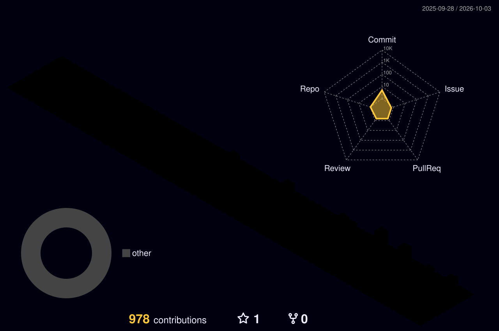

<!-- ===================== HEADER ===================== -->


<p align="center">
  <a href="https://aditya-sharma.lovable.app/">
    
  </a>
</p>

<p align="center">
  <a href="https://aditya-sharma.lovable.app/"></a>
  <a href="https://in.linkedin.com/in/aditya-sharma-788b41261"></a>
  <a href="mailto:aditya@zylitix.ai"></a>
  <a href="https://dtaxo.ai"></a>
  
</p>

<br/>

<!-- ===================== 3D CONTRIBUTION SKYLINE ===================== -->
<h2 align="center">🌆 My Contribution Skyline — in 3D</h2>

<p align="center">
  
</p>

<br/>

<!-- ===================== ABOUT ===================== -->


## 🧠 About Me

```ts
const aditya = {
  name:      "Aditya Sharma",
  role:      "Full-Stack + GenAI + Automation Engineer",
  company:   "Zylitix Technologies",
  building:  "DTAXO — AI-powered US tax automation SaaS",
  layers:    ["frontend", "backend", "genai", "rpa", "devops"],
  stack: {
    frontend: ["React", "Next.js", "TypeScript", "Tailwind", "shadcn/ui"],
    backend:  ["Node.js", "Express", "Prisma", "PostgreSQL", "FastAPI"],
    genai:    ["LLM APIs", "RAG", "structured extraction", "agents", "prompt eng"],
    infra:    ["Azure AKS", "Kubernetes", "Docker", "nginx", "GitHub Actions"],
    async:    ["RabbitMQ", "BullMQ + Redis", "MQTT", "cron workers"],
  },
  philosophy:   "Own the vertical slice — UI to API to model to bot to infra.",
  currentFocus: "LLM document pipelines + self-healing automation pods",
  reachMe:      "aditya@zylitix.ai",
};
```

<br clear="right"/>

---

<!-- ===================== GENAI ===================== -->
## 🤖 GenAI & AI Engineering

<table>
<tr>
<td width="50%" valign="top">

**🧩 What I build with LLMs**
- Document → structured-JSON extraction pipelines
- Multi-step agent workflows with tool calling
- RAG over domain corpora (vector search + rerank)
- Prompt engineering with schema validation & retries
- Token accounting, cost metering, usage dashboards
- Guardrails: hallucination checks, confidence scoring

</td>
<td width="50%" valign="top">

**⚙️ How I ship it to production**
- Async job queues so inference never blocks the API
- Deterministic fallbacks when a model is unsure
- Per-tenant usage limits + full audit trails
- Blob-backed artifact storage for every run
- Observability: structured logs, retries with backoff
- Human-in-the-loop review screens for edge cases

</td>
</tr>
</table>

<p align="center">
  
</p>

---

<!-- ===================== STACK ===================== -->
## 🛠 Tech Arsenal

<div align="center">

**Languages & Core**


**Frontend**


**Backend & Data**


**Cloud, DevOps & Infra**


**Tools**


</div>

---

<!-- ===================== PROJECT ===================== -->
## 🚀 Flagship Build — DTAXO

> **A multi-tenant US 1040 tax-automation SaaS** · [dtaxo.ai](https://dtaxo.ai)

| Pillar | What I engineered |
|---|---|
| 🎨 **Frontend** | Role-aware React + TS dashboards, design system, 4 roles × 8 breakpoints device QA |
| ⚙️ **Backend** | Express 5 + Prisma multi-tenant API, 2FA, RBAC, org-scoped data, encrypted PII |
| 🤖 **GenAI** | LLM document extraction → workbook / leadsheet generation with schema validation |
| 🦾 **Automation** | Orchestrated Windows worker pods driving desktop tax software end-to-end |
| ☁️ **DevOps** | Azure AKS, snapshot-based pod provisioning (~3 min cold start), autoscaling pools |
| 📡 **Realtime** | MQTT task-status streams + RabbitMQ / BullMQ queue routing across engines |
| ✅ **Quality** | Zero-open-issue SonarQube gate across both frontend and backend repos |

---

<!-- ===================== STATS ===================== -->
## 📊 GitHub Analytics

<p align="center">
  
  
</p>

<p align="center">
  
</p>

<p align="center">
  
</p>

---

<!-- ===================== SNAKE ===================== -->
<h3 align="center">🐍 Watch my contributions get eaten</h3>

<p align="center">
  
</p>

---

<!-- ===================== PRINCIPLES ===================== -->
## 🧭 How I Engineer

<div align="center">

| | |
|---|---|
| 🛡️ **Production first** | Real customer data and money flows — stability beats cleverness |
| 🔍 **Trace before you touch** | Understand the full flow, then make the smallest safe change |
| ✅ **Gates, not vibes** | Tests, static analysis and SonarQube before anything is "done" |
| 🧱 **Own the whole slice** | If I build the feature, I ship the infra and watch it in prod |

</div>

---

<!-- ===================== CONTACT ===================== -->
<h2 align="center">📬 Let us build something</h2>

<p align="center">
  <a href="https://aditya-sharma.lovable.app/"></a>
  <a href="https://in.linkedin.com/in/aditya-sharma-788b41261"></a>
  <a href="mailto:aditya@zylitix.ai"></a>
</p>


